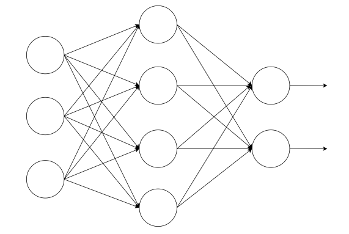
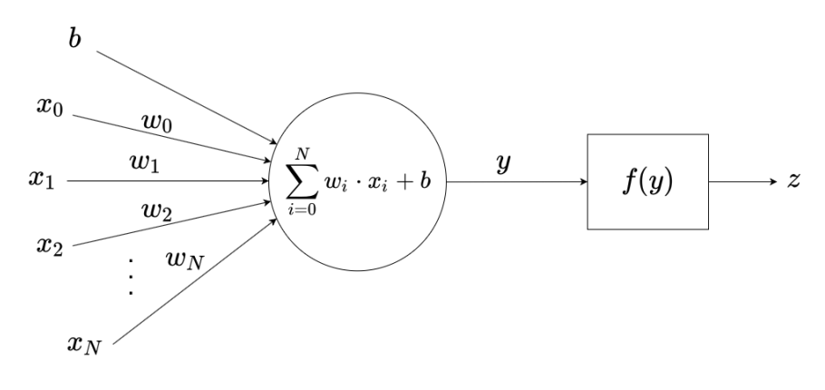
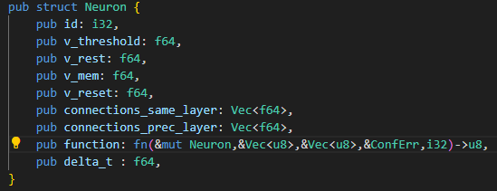
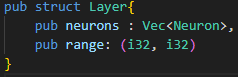
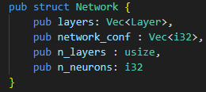
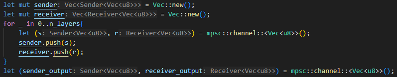
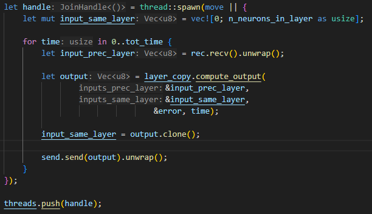

# Spiking Neural Networks and Resilience

This project focuses on creating and simulating a **spiking neural network (SNN)**, introducing errors in various components of the network to study its resilience.

The network is composed of neurons organized in layers, connected via weighted, unidirectional edges. Our implementation uses three main data structures: Neuron, Layer, and Network, which cooperate to manage the network at different levels of abstraction.

Each layer runs as a separate **thread**, and layers communicate with each other using **channels**, allowing asynchronous message passing and coordination between layers.

  
  

## Neuron structure

The lowest-level structure is the Neuron, which stores fundamental neuron parameters, including:

- Membrane potential (v_mem)  
- Threshold potential (v_threshold)  
- Resting potential (v_rest)  
- Reset potential (v_reset)  
- **LIF**: *Leaky-Integrate-and-Fire* (function used to compute neuron's output)
- Interval between consecutive input spikes (delta_t)

## Layer structure 

Each layer runs in its own thread. Layers communicate via channels, sending vectors of outputs at time t to the next layer and receiving vectors of inputs from the previous layer calculated at time t-1.
Additionally, neurons can transmit their outputs to other neurons within the same layer.

Two separate vectors store incoming weights: one for neurons from the previous layer and another for neurons in the same layer.
Without distinguishing these connections, a deadlock could occur at the first simulation step because neurons in the same layer would wait for each other’s outputs. By assuming the initial outputs of same-layer neurons are zero at time t=0, deadlocks are avoided.

## Network structure
Manages the creation of a configurable network, initializes each layer as a separate thread, and handles the simulation.

## Simulations
### Simulation without  errors
For *n* inputs, the simulation computes the corresponding *n* outputs of the **SNN** asynchronously, with each layer running in its own thread.

Channels set up:  

Threads handle:  

### Simulation with error injection
To evaluate the network’s resilience, controlled faults are injected into different components of the system during simulation. These faults emulate typical hardware-level errors that can occur in hardware or digital computing environments.  

Errors:
- **Stuck-at-0 / Stuck-at-1**: These represent permanent faults, where a bit in memory or a circuit output remains fixed at logic 0 or logic 1 throughout the entire simulation.  
- **BitFlip**: A transient fault that occurs once at a random time step. A randomly chosen bit in the selected component is inverted (0 → 1 or 1 → 0)  

Components attacked: 
- Threshold
- Weights
- Adder
- Multiplier

Workflow:
- Specify the number of inferences (simulations).
- Choose one of three error types: Stuck-at-0, Stuck-at-1, BitFlip.
- Choose components to target (e.g., threshold).
- Randomly select a component for each simulation and apply the error.

The modified bit is randomly selected (not configurable).  
Hardware interpretation: components correspond to physical neuron elements. In simulation, they are represented in software to allow error injection:
Resilience is evaluated by comparing simulation results with and without errors.

Example: a weight register bit stuck at 0 causes that connection’s effective strength to remain abnormally low.  
Example: a single-event upset in hardware flips a neuron’s threshold bit, temporarily altering its firing behavior.
